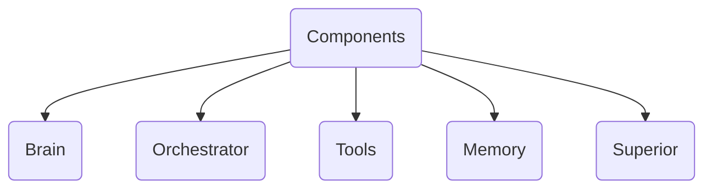

**What is Agentic AI?**
Agentic AI is a type of AI that can take the task or goal from user and then work towards completing on its own, with minimal human guidance.

*Key Characteristic*
- Autonomy
- Goal Oriented
- Planning
- Reasoning
- Adaptability
- Context Awareness

*Components*

---

Resources:
- [IBM](https://www.ibm.com/think/topics/agentic-ai)
- [Red Hat](https://www.redhat.com/en/topics/ai/what-is-agentic-ai)
- Sir YT [Link](https://www.youtube.com/watch?v=GWnSsjT4V68&list=PLKnIA16_RmvYsvB8qkUQuJmJNuiCUJFPL&index=3)