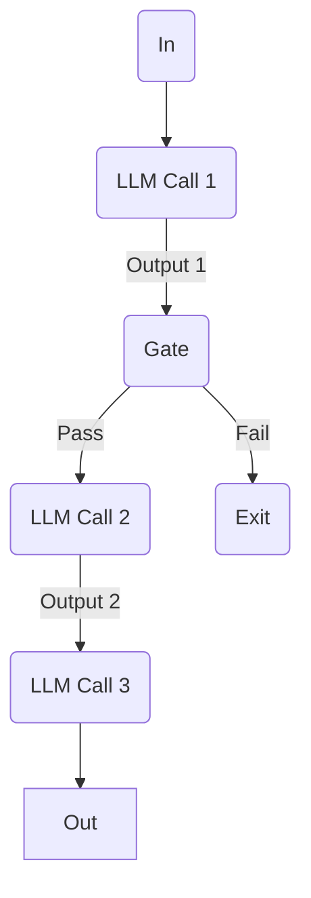
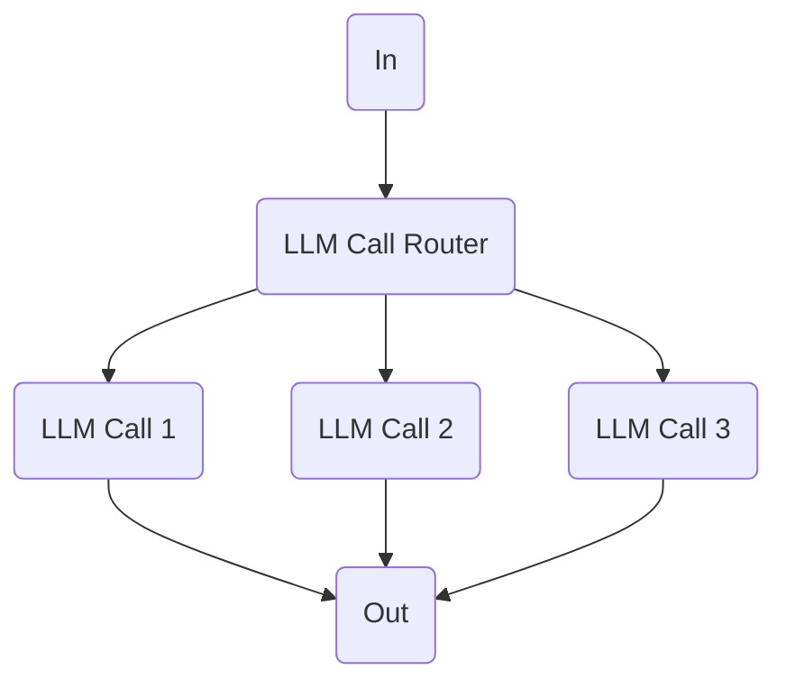
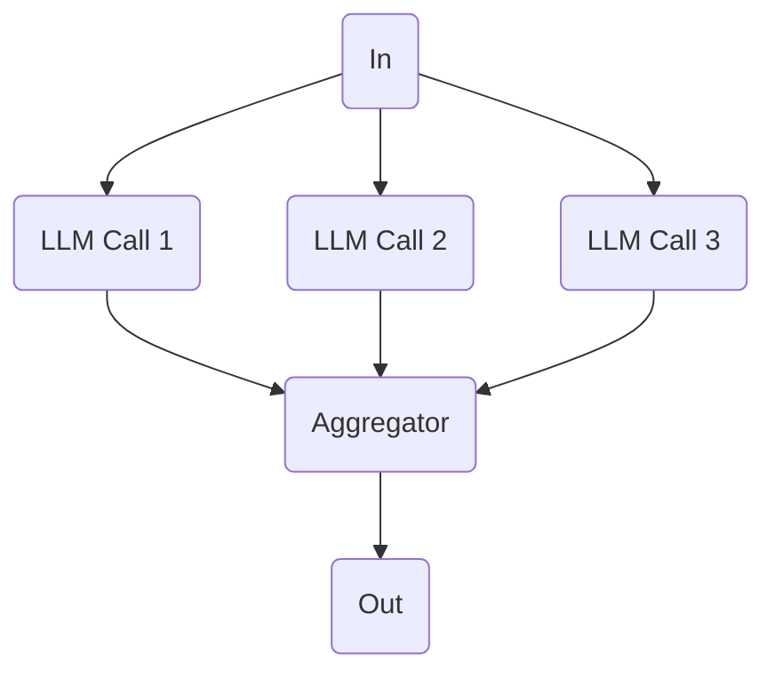
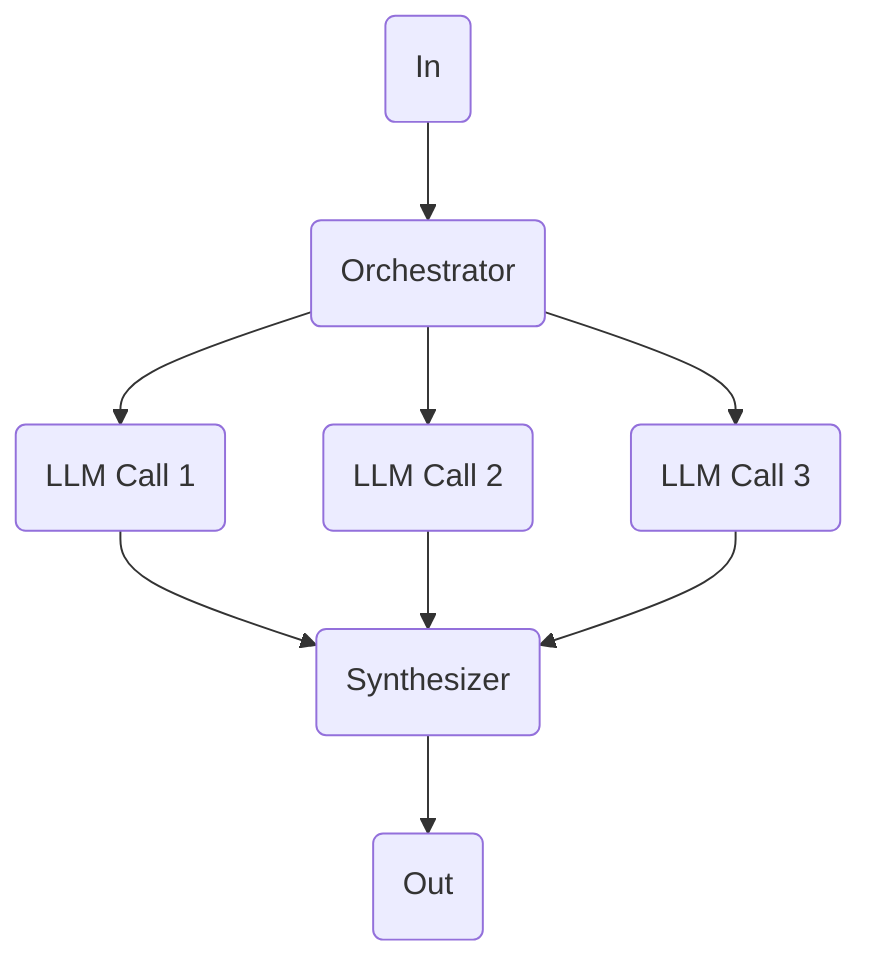
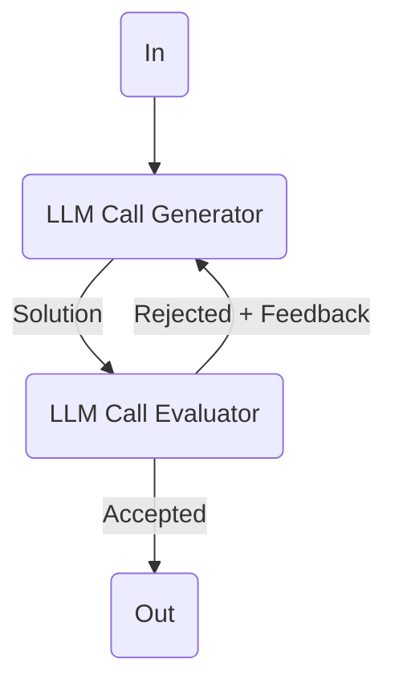

# What is LangGraph?

- LangGraph is Orchestration framework building intelligent, stateful, and multi-step LLM workflows.

# LLM Workflow

## Prompt  Chaining

## Routing

## Parallelization

## Orchestrator Workflow

## Evaluator Optimizer

---

**Few Topic need to know**
- Graphs, Nodes, Edges
- State
- Reducers

---

Sir Lecture: [YT](https://www.youtube.com/watch?v=D5KhiCDM9XQ&list=PLKnIA16_RmvYsvB8qkUQuJmJNuiCUJFPL&index=5)