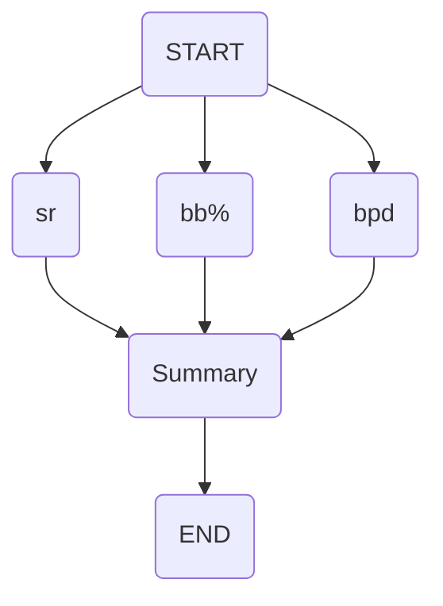
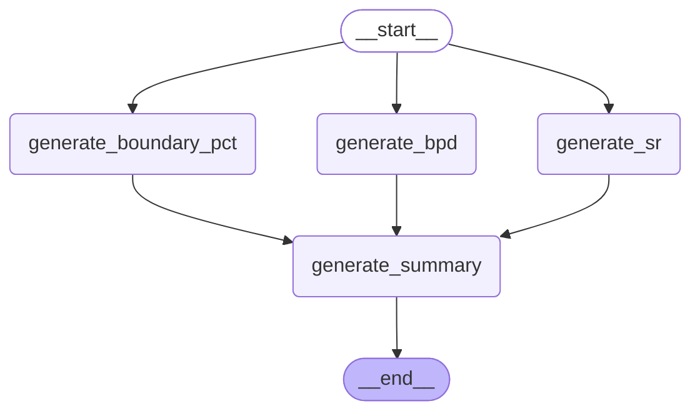

**Workflow**

```mermaid
graph TD
    A(START) --> B(sr)
    A --> C(bb%)
    A --> D(bpd)
    B --> E(Summary)
    C --> E
    D --> E
    E --> F(END)
```

**State**
```
# User Input
runs: int
balls: int
fours: int
six: int

# Desire Output
sr: float
bpd: float
boundary_pct: float
summary: str
```


**Output**

```mermaid
graph TD;
        __start__([<p>__start__</p>]):::first
        generate_sr(generate_sr)
        generate_bpd(generate_bpd)
        generate_boundary_pct(generate_boundary_pct)
        generate_summary(generate_summary)
        __end__([<p>__end__</p>]):::last
        __start__ --> generate_boundary_pct;
        __start__ --> generate_bpd;
        __start__ --> generate_sr;
        generate_boundary_pct --> generate_summary;
        generate_bpd --> generate_summary;
        generate_sr --> generate_summary;
        generate_summary --> __end__;
        classDef default fill:#f2f0ff,line-height:1.2
        classDef first fill-opacity:0
        classDef last fill:#bfb6fc
```
