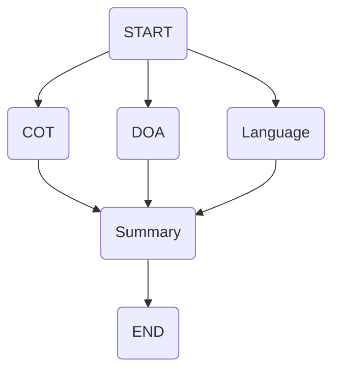

**Workflow**

```mermaid
graph TD
    A(START) --> B(COT)
    A --> C(DOA)
    A --> D(Language)
    B --> E(Summary)
    C --> E
    D --> E
    E --> F(END)
```

**State**
```
# User Input
summary_feedback: str
avg_final_score: float
```


**Output**
```mermaid
```