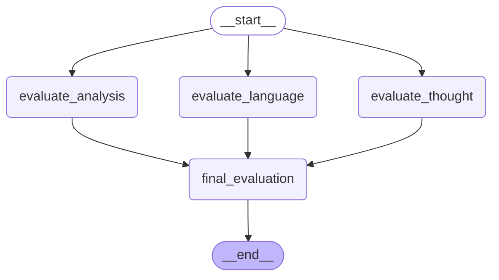

**Parallel Workflows**

```mermaid
graph TD;
        __start__([<p>__start__</p>]):::first
        evaluate_language(evaluate_language)
        evaluate_analysis(evaluate_analysis)
        evaluate_thought(evaluate_thought)
        final_evaluation(final_evaluation)
        __end__([<p>__end__</p>]):::last
        __start__ --> evaluate_analysis;
        __start__ --> evaluate_language;
        __start__ --> evaluate_thought;
        evaluate_analysis --> final_evaluation;
        evaluate_language --> final_evaluation;
        evaluate_thought --> final_evaluation;
        final_evaluation --> __end__;
        classDef default fill:#f2f0ff,line-height:1.2
        classDef first fill-opacity:0
        classDef last fill:#bfb6fc
```