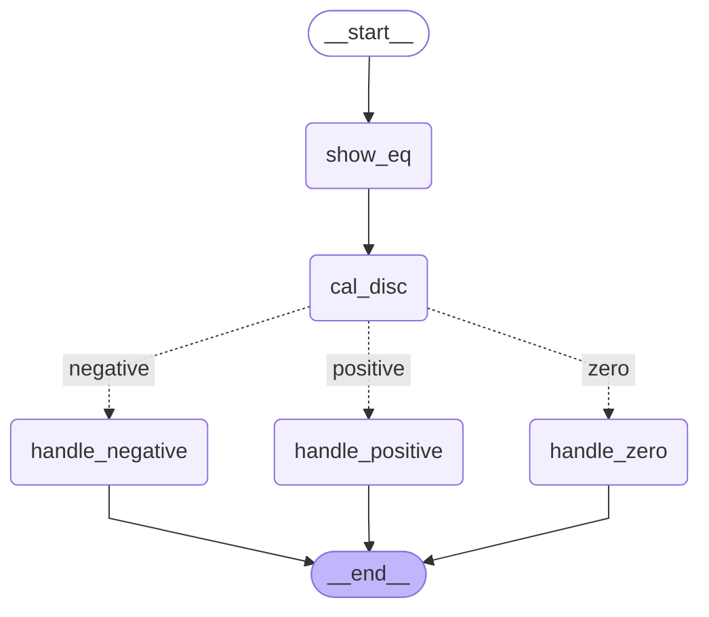

**Workflow**

```mermaid
---
config:
  flowchart:
    curve: linear
---
graph TD;
        __start__([<p>__start__</p>]):::first
        show_eq(show_eq)
        cal_disc(cal_disc)
        handle_positive(handle_positive)
        handle_zero(handle_zero)
        handle_negative(handle_negative)
        __end__([<p>__end__</p>]):::last
        __start__ --> show_eq;
        cal_disc -. &nbsp;negative&nbsp; .-> handle_negative;
        cal_disc -. &nbsp;positive&nbsp; .-> handle_positive;
        cal_disc -. &nbsp;zero&nbsp; .-> handle_zero;
        show_eq --> cal_disc;
        handle_negative --> __end__;
        handle_positive --> __end__;
        handle_zero --> __end__;
        classDef default fill:#f2f0ff,line-height:1.2
        classDef first fill-opacity:0
        classDef last fill:#bfb6fc
```