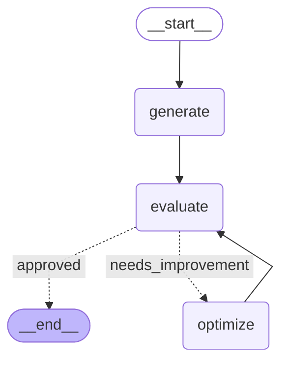

**Workflow**



---


```cs
          +-----------+             
          | __start__ |             
          +-----------+             
                 *                  
                 *                  
                 *                  
           +----------+             
           | generate |             
           +----------+             
                 *                  
                 *                  
                 *                  
           +----------+             
           | evaluate |             
           +----------+             
          ...         ..            
         .              ..          
       ..                 .         
+---------+           +----------+  
| __end__ |           | optimize |  
+---------+           +----------+  
```